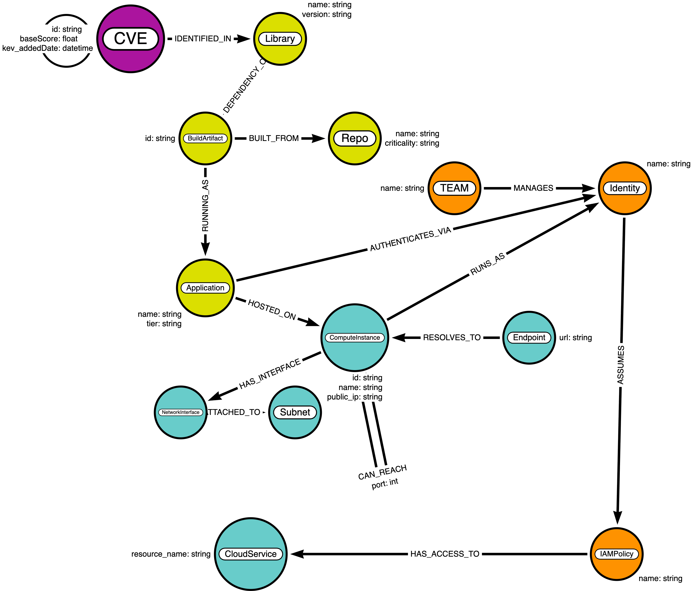

# Attack Path Analysis
## Multi-Hop Lateral Movement & Exploitation Paths
### Cybersecurity Use Case: Code-to-Crown-Jewel Traceability with Neo4j
*Based on: [pedroleitao-neo4j/cyber-apa](https://github.com/pedroleitao-neo4j/cyber-apa)*

---

# Why Attack Path Analysis?
### Beyond single CVEs: expose the full kill chain
- **Perimeter gaps:** Internet-facing CVEs are only the first hop.
- **Hidden lateral routes:** Internal reachability and IAM rights create invisible bridges.
- **Crown Jewels at risk:** Data exfiltration paths stay unknown without path traversal.
- **Goal:** Quantify blast radius and cut chokepoints before attackers move.

---

# What is APA?
### The "stepping stone" mindset
Think of an attacker crossing a river:
- Each **stone** is a reachable host or permission.
- A single slip point (CVE) can lead across many stones.
- Mapping stones (paths) lets defenders pull the key ones and break the journey.

---

# Lateral Movement Scenario
### Modeled in this repo
1. **Initial entry:** `api-gateway-01` compromised on the edge.
2. **Recon:** Attacker maps internal network routes.
3. **Sideways:** Hops to `i-0002` via open port 8080.
4. **Final objective:** Reach `CoreBankingDB` (P0) via port 5432 for exfiltration.

---

# Solution: Cyber APA Graph
### Built on the VPEM base model
- **New relationship:** `CAN_REACH` encodes internal network paths.
- **Transitive traversal:** Follow 3+ hops from KEV CVEs to P0 apps.
- **Graph visibility:** Unite CVEs, software lineage, IAM, and infrastructure.
- **Outcome:** Fast impact analysis and choke-point hardening.

---

# Data Layers in Play
### Security Knowledge Graph composition
- **Threat intel:** CVE + CISA KEV exploitation status.
- **Software lineage:** Libraries → BuildArtifacts → Applications.
- **Infrastructure:** ComputeInstances (public and internal) plus reachability edges.
- **Identity & access:** Identities, IAMPolicies, CloudServices for blast radius.

---

# Resulting Schema
### Extended for lateral movement


---

# Core Project Assets
### Two notebooks drive the flow
1. **Data Ingestion** (`loader.ipynb`)
   - Adds `CAN_REACH` edges and the P0 `CoreBankingDB` target.
   - Ensures gateway (`i-0001`), worker (`i-0002`), and DB (`i-9999`) exist.
2. **Attack Path Analysis** (`apa.ipynb`)
   - Runs Cypher to find KEV-exposed hosts, IAM blast radius, and multi-hop paths.
   - Visualizes paths with `networkx` to highlight lateral movement.

---

# Loading Lateral Movement Data
### From `create_lateral_movement_data()`
- Creates the Crown Jewel app `CoreBankingDB` and its host `prod-db-internal`.
- Connects `api-gateway-01` → `i-0002` (port 8080) → `prod-db-internal` (port 5432).
- Binds the DB host to the P0 application via `HOSTED_ON`.
- Prints confirmation after writing to Neo4j.

---

# Identify the Front Door
### KEV-exploited, internet-facing instances
```cypher
MATCH (v:CVE)-[:LISTED_IN]->(:Catalog {name: 'CISA KEV'})
MATCH (v)-[:IDENTIFIED_IN]->(:Library)-[:DEPENDENCY_OF]->(:BuildArtifact)
      -[:RUNNING_AS]->(app:Application)-[:HOSTED_ON]->(ins:ComputeInstance)
WHERE ins.public_ip IS NOT NULL AND v.baseScore >= 9.0
RETURN v.id AS Recent_CVE, app.name AS Exposed_App, ins.name AS Hostname, ins.public_ip AS IP
```
**Purpose:** Flag the edge hosts that form the initial breach point.

---

# IAM Blast Radius
### What can the breached identity touch?
```cypher
MATCH (ins:ComputeInstance {name: 'api-gateway-01'})-[:RUNS_AS]->(id:Identity)
MATCH (id)-[:ASSUMES]->(pol:IAMPolicy)-[:HAS_ACCESS_TO]->(cs:CloudService)
RETURN id.name AS Identity, pol.name AS Policy, cs.resource_name AS Target_Resource
```
**Purpose:** Map immediate impact if the edge box is compromised.

---

# Multi-Hop Path to Crown Jewels
### Trace lateral movement via `CAN_REACH`
```cypher
MATCH (start:ComputeInstance {name: 'api-gateway-01'})
MATCH path = (start)-[:CAN_REACH*1..3]->(target:ComputeInstance)<-[:HOSTED_ON]
             -(targetApp:Application {tier: 'P0'})
RETURN path
```
**Visualize:** Use `networkx` to render nodes (ComputeInstances, Applications) and edge labels (ports).

---

# Visualization Output
### NetworkX view of lateral paths
- Directed graph shows hop sequence and port labels.
- Color-coded by type (ComputeInstance = blue, Application = orange).
- Highlights chokepoints to harden (e.g., the worker node or DB path).

---

# Graph Advantage: Impact & Chokepoints
### Why graphs win for APA
- **Transitive reasoning:** $CAN\_REACH^{3}$ traversals stay performant.
- **Immediate blast radius:** Servers reachable from a KEV CVE in one query.
- **Chokepoint discovery:** Find nodes whose removal cuts the most paths.
- **Remediation focus:** Patch or segment the smallest set that collapses routes.

---

# Outward System Integration
### Where these insights flow
- **SOAR:** Automate containment (revoke IAM policies on breached nodes).
- **Micro-segmentation:** Prioritize cutting high-betweenness `CAN_REACH` edges.
- **CI/CD guards:** Fail builds introducing new KEV-exposed dependencies.
- **Compliance:** Report reachability to sensitive data stores (PCI, SOC2).

---

# Getting Started
### Minimal steps
1. Load VPEM base data in Neo4j.
2. Run `loader.ipynb` to add lateral movement edges.
3. Execute `apa.ipynb` queries; inspect KEV exposure, IAM blast radius, and paths.
4. Use visuals to drive segmentation and patching decisions.

---

# Questions?
**GitHub:** [pedroleitao-neo4j/cyber-apa](https://github.com/pedroleitao-neo4j/cyber-apa)
**Reference:** [VPEM (Vulnerability Prioritization and Exposure Management)](https://github.com/pedroleitao-neo4j/cyber-vpem)
